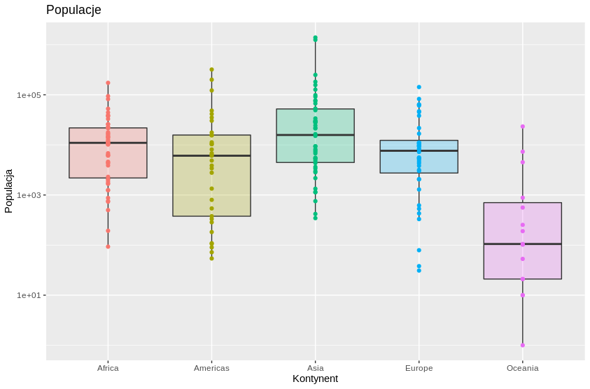
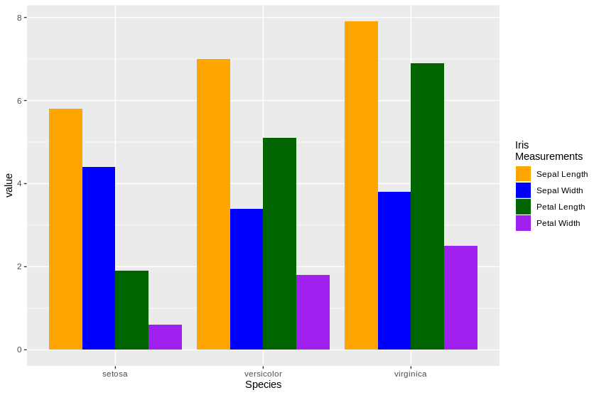

## Zanim zaczniemy:
Przydatne ściągawki! <br>
1. ggplot2: https://rstudio.com/wp-content/uploads/2015/03/ggplot2-cheatsheet.pdf <br>
2. dplyr: https://rstudio.com/wp-content/uploads/2015/03/ggplot2-cheatsheet.pdf

# Wprowadzenie

Pakiet `ggplot2` jest jednym z najbardziej zaawansowanych narzędzi stworzonych do wizualizacji danych w języku programowania R. Został wydany w 2007 roku przez Hadleya Wickhama. Biblioteka oparta jest na gramatyce, której budowę przedstawia poniższa grafika:


Na zajęciach postaramy się pokrótce zaprezentować Państwu wszystkie z powyższych struktur z naciskiem na przykłady użycia.<br>

Na zajęciach będziemy operowali na zbiorze danych `countries` z pakietu `SmarterPoland`. W związku z tym, wczytajmy dane oraz wyświetlmy kilka wierszy:
```{r wczytanie, include = FALSE, echo = FALSE, warning = FALSE}
#install.packages("SmarterPoland")
library(ggplot2)
library(dplyr)
```

```{r countries, message = FALSE, include=TRUE, echo = TRUE}
#install.packages("SmarterPoland")
library(SmarterPoland)
head(countries)
```

# Podstawowe znaczniki `ggplot2`

Każdy widoczny wykres stworzony w pakiecie `ggplot2` składa się z co najmniej trzech elementów:

### Funkcja `ggplot()`

Funkcja `ggplot()` tworzy szkielet obiektu, jakim będzie nasz wykres i to jej zawdzięczamy wyświetlanie obrazka. Jej deklaracja może być pusta, jednak zazwyczaj zawiera dwa najważniejsze informacje dotyczące wszystkich elementów grafiki: o danych - parametr `data` oraz mapowaniu - `mapping`. Spróbujmy sprawdzić skład takiego obiektu:

```{r ggplot, echo=TRUE, message=FALSE, warning=FALSE, paged.print=FALSE}
ggplot(data = countries)

p <- ggplot(data = countries, mapping = aes(x = country, y = death.rate))
#str(p)

ggplot(countries, aes(x = birth.rate, y = death.rate))
ggplot(countries, aes(x = country, y = population))
```

### Operator `+`

W pakiecie `ggplot2` operator `+` jest łącznikiem pomiędzy kolejnymi składowymi obiektu, jakim jest pożądany wykres.

Dla ciekawych:
```{r, plus}
ggplot2:::`+.gg`
```

### Statystyki i geometrie:

Kolejne wartswy nakładane na wykres to między innymi statystyki i geometrie. Statystyki służą do agregacji danych, natomiast zadaniem geometrii jest graficzna reprezentacja wartości liczbowych. Każda statystyka wymaga geometrii i na odwrót - każda geometria wymaga statystyki. Bardzo często są określone w sposób domyślny, co można sprawdzić w dokumentacji, ale mogą też zostać ręcznie zmienione:

```{r geometrie, warning = FALSE}
p <- ggplot(countries, aes(x = birth.rate, y = death.rate)) +
  geom_point()
#to samo co
#ggplot(countries, aes(x = birth.rate, y = death.rate)) +
# geom_point(stat = 'identity')
p

p <- ggplot(data = countries, aes(x = continent, y = death.rate)) +
  geom_point()
#to samo co
#ggplot(countries, aes(x = continent, y = death.rate)) +
# geom_point(stat = 'identtity')
p

p <- ggplot(countries, aes(x = continent)) +
  geom_bar()
#to samo co
#ggplot(countries, aes(x = continent)) +
# geom_bar(stat = 'count')
p

p <- ggplot(countries, aes(x = birth.rate)) +
  stat_bin(binwidth = 3)
#to samo co
#ggplot(countries, aes(x = birth.rate)) +
# stat_bin(binwidth = 3, geom = 'bar')
p

#Zauważmy, że oś y zostaje nazwana tak jak określimy ją w aes()
#Bilans ludności:
ggplot(countries, aes(x = country, y = (birth.rate-death.rate)*population/1000)) +
         geom_point() 


#Jak zmienić tytuł osi y? Funkcja ylab (Dla osi x - xlab()):
ggplot(countries, aes(x = country, y = (birth.rate-death.rate)*population/1000)) +
  geom_point() +
  ylab("Bilans ludności")

#Jak dodać tytuł wykresu? Funkcja ggtitle():

ggplot(countries, aes(x = country, y = (birth.rate-death.rate)*population/1000)) +
  geom_point() +
  ylab("Bilans ludności") +
  ggtitle("Bilans ludności w poszczególnych państwach świata")
```


Lista wszystkich dostępnych geometrii dostępna jest pod linkiem: https://ggplot2.tidyverse.org/reference/

# Mapowanie

Wykresy to tak naprawdę wizualizacje wartości danych dla określonych obiektów. Prezentację możemy zaplanować w różny sposób, korzystając z mapowania za pomocą funkcji `aes()`. Każdy rodzaj geometrii przyjmuje różne możliwe mapowania (a niektórych wymaga), ich lista znajduje się oczywiście w dokumentacji funkcji.
```{r mapowanie, message=FALSE, warning=FALSE}
#kolor i przezroczystość punktów nie jest zależna od danych, więc nie jest częścią mapowania, a własnością geom_point()
ggplot(data = countries, aes(x = birth.rate, y = death.rate)) +
  geom_point(color = "blue", alpha = 0.4)

#kolor i rozmiar punktów jest zależna od danych, więc jest częścią mapowania
ggplot(countries, aes(x = birth.rate, y = death.rate, colour = continent, size = population)) +
  geom_point()

#Parametr alpha dla zmiennej dyskretnej:
ggplot(countries, aes(x = birth.rate, alpha = continent)) +
  stat_density()

#Zachowanie parametru color dla zmiennej ciągłej:
ggplot(countries, aes(x = continent, y = birth.rate, color = death.rate)) +
  geom_point()
```

# Dodawanie geometrii:

Biblioteka `ggplot2` umożliwia nam dodanie szerokiej gamy rodzajów wykresów w bardzo łatwy sposób. Co istotne, geometrie mogą być ze sobą łączone w ramach jednego wykresu:

```{r laczenie geometrii, message=FALSE, warning=FALSE}
# Warstwy geometrii zgadzają sie z kolejnością wywołań
ggplot(countries, aes(x = continent, y = birth.rate, fill = continent)) +
  geom_boxplot(outlier.color = NA) + # w celu unikniecia dublowania outlierow z geom_point
  geom_point()

# Zauważmy różnicę między fill a color, także w kontekście geom_point:
ggplot(countries, aes(x = continent, y = birth.rate, color = continent)) +
  geom_boxplot(outlier.color = NA) +
  geom_point()

# Oczywiście funkcje geometrii mają swoje parametry - tu: losowe rozmieszczenie punktów względem przedziału osi x
ggplot(countries, aes(x = continent, y = birth.rate, color = continent)) +
  geom_boxplot(outlier.color = NA) +
  geom_point(position = "jitter")

ggplot(countries, aes(x=birth.rate, y=death.rate, label = country)) +
  geom_point() + 
  geom_smooth(se=FALSE, size=2) +
  geom_text(data = countries[which.max(countries[["death.rate"]]),], vjust = 1.5)

ggplot(data = countries, aes(x = continent, y = death.rate)) +
  geom_point(position = "jitter") +
  geom_boxplot(outlier.color = NA) 


```

<br>

# Przykłady innych elementów gramatyki:
```{r przyklady, warning=FALSE}
#Miary
ggplot(countries, aes(x = continent, y = birth.rate, color = death.rate)) +
  geom_point() +
  scale_y_continuous(limits = c(0, 100), expand = c(0.1, 0.1))

#Przesuniecia
ggplot(countries, aes(fill = continent, y = population, x = 0)) + 
  geom_bar(position = "stack", stat = "identity")

#Uklad wspolrzednych
ggplot(countries, aes(x = factor(1), fill = continent)) +
  geom_bar(width = 1) +
  coord_polar("y")

#Dekoracje
ggplot(countries, aes(x = factor(1), fill = continent)) +
  geom_bar(width = 1) +
  coord_polar("y") +
  theme_void()

#Panele
ggplot(countries, aes(x = death.rate, y = birth.rate)) +
  geom_point() +
  facet_wrap(vars(continent))
```

# Zadanie do wykonania
Stwórz następujące wykresy:




