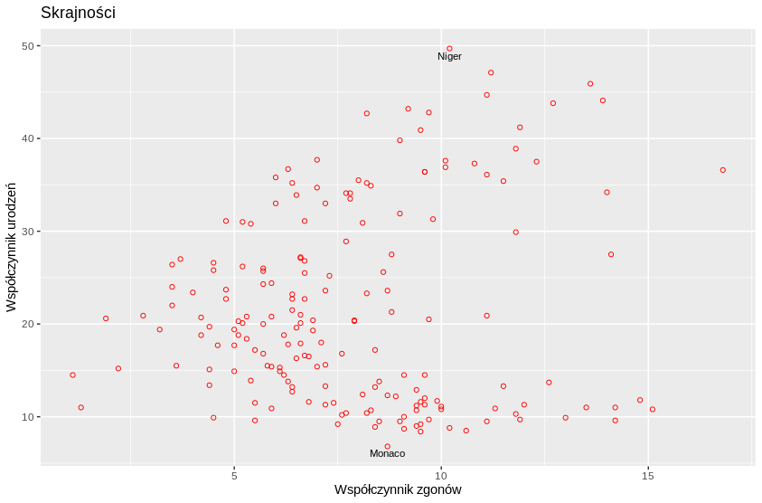
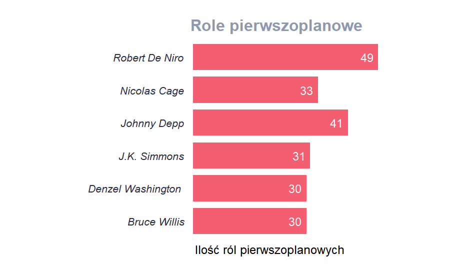

<center> <h1>Zbiór zadań z ggplot</h1> </center>
<center> <h3>zadania pochodzą z warsztatów <br /> organizowanych 12 grudnia 2019</h3> </center>


# Opis
Poniżej zamieszczona jest lista zadań, która była opracowywana w różnych grupach na warszatach ggplot 12 grudnia 2019r. https://www.facebook.com/events/2336582616605870/

### Trudność zadań

Trudnosci zadań opsane są gwiazdkami przy ich tytułach i odpowiadają one szacowanym czasom, które początkujący uczestnik powinien na nie poświęcić, gdzie:
<br />
* - do 10 min<br />
**  - do 20 min<br />
*** - powyżej 30 min<br />


<center>
<h1>Zadania</h1> 
</center>


## 1. Punktowy wykres zależności współczynników wraz z wyróżnionymi krajami *

### Opis 
Celem poniższego zadania jest sprawdzanie swoich umiejętności w użyciu funkcji geom_point() z różnymi wartościami zaznaczonymi na osiach x i y. Ponadto, zaznaczyć należy państwa o najwyższym oraz najniższym współczynniku urodzeń na świecie.
<center>

</center>
```{r echo=TRUE,eval=FALSE}
#install.packages("SmarterPoland")
library(ggplot2)
library(SmarterPoland)

```
<br /> <br /> 

## 2. Gęstości współczynników zgonów na różnych kontynentach **

### Opis 
Zadaniem jest przygotowanie porównania gęstości współczynnika zgonów na kontynentach za pomocą 5 figur, wyświetlonych na różnych panelach. Należy zwrócić uwagę na różne kolory wykresów, przerywaną linię oraz podpisy.

<center>

</center>

<br /> <br /> 

## 3. Populacje *

### Opis
W zadaniu należy wykonać wizualizację rozkładu populacji wśród państw na różnych kontynentach, zarówno za pomocą wykresu skrzynkowego jak i punktowego. Zwróć uwagę na miarę zastosowaną w wyświetleniu skali y

<center>

</center>

<br /> <br /> 

## 4. Złożony wykres kolumnowy **

### Opis
Ta wizualizacja zostanie przedstawiona na zbiorze danych iris, a jej celem jest prezentacja różnych średnich wartości dla poszczególnych gatunków. 


<center>

</center>

<br /> <br /> 

```{r echo=TRUE,eval=FALSE}
library(ggplot2)
library(reshape2)
iris2 <- melt(iris, id.vars="Species")

```

## 5. Oceny filmów * 

### Opis 
Celem jest przedstawienie ilości filmów, w różnych przedziałach oceny z serwisu IMDB.
(Sama wielkość przedziałów jest dowolna, nie trzeba jej określać by rozwiązać zadanie).
Zadanie wymaga użycia jedynie podstawowych funkcji i geometrii ggplot2

```{r echo=TRUE,eval=FALSE}
library(ggplot2)
library(dplyr)

movies <- read.csv("data/movie_metadata.csv")


```
<br /> <br /> 

## 6. Budżety filmowe * 

### Opis 
Wizualizacja lini trendu budżetów w filmach na przestrzeni lat<br />
a) wszystkich filmów IMDb<br />
b) TOP 500 filmów IMDb, czy z tą wizualizacją jest wszystko w porządku? <br />

```{r echo=TRUE,eval=FALSE}
library(ggplot2)
library(dplyr)

movies <- read.csv("data/movie_metadata.csv")

movies500 <- arrange(movies, desc(num_voted_users))
movies500 <- head(movies, 500)


```
<br /> <br /> 

## 7. Aktorzy ** 

### Opis 
Celem w tym zadaniu jest odtworzenie wykresu poniżej z jak największą ilością detali. 
Dla ułatwienia w zadaniu zostały podane dwie funkcje, którch wykożystanie jest praktycznie niezbędne.

<center>

</center>
```{r echo=TRUE,eval=FALSE}
library(ggplot2)
library(dplyr)

movies <- read.csv("data/movie_metadata.csv")

movies_actors <- movies%>%
  group_by(aktor=actor_1_name)%>%
  summarise(ilosc=n())%>%
  arrange(desc(ilosc))%>%
  head(6)

head(movies_actors)


# 2 nowe rzeczy, których użycie będzie konieczne
?geom_col
?coord_flip
```
<br /> <br /> 

## 8. Czy filmy są coraz gorsze? *** 

### Opis 
Celem zadania jest dokładne odtworzenie wykresu z poniższego zdjęcia

<center>

</center>
```{r echo=TRUE,eval=FALSE}
library(ggplot2)
library(dplyr)


movies <- read.csv("data/movie_metadata.csv")

movies_year <- movies%>%
  group_by(title_year)%>%
  summarise(score=mean(imdb_score))


```
<br /> <br /> 


## Opis 

W kolejnych 3 zadaniach będziemy korzystać z biblioteki nycflights13. Zwizualizujemy między innymi ukształtowanie terenu w USA, 

## 9. "Mapka" USA ** 

1. Za pomocą zbioru "airports" wczytanego z biblioteki nycflights13 narysuj mapę Ameryki północnej (bez Hawajów i Alaski - sam ląd)
podpowiedź: rozważ skale obie skale continious i narysuj wykres punktowy, oraz odpowiednio ogranicz
2. Uwzględnij ukształtownie terenu (podpowiedź: alt - wysokość nad poziomem morza, użyj kolorów )
3. Następnie na tej samej mapie wyróżnij kolorem strefy czasowe


</center>
```{r echo=TRUE,eval=FALSE}
library(ggplot2)
library(nycflights13)

flights

```
<br /> <br /> 

## 10. Odległości lotu *   
Dla każdego lotniska wykresy skrzypcowowe odległości lotu w każdym z pierwszych sześciu miesięcy roku

</center>
```{r echo=TRUE,eval=FALSE}
library(ggplot2)
library(nycflights13)

airports


```
<br /> <br /> 


## 11. Upiększanie wykresu *


Do danego wykresu (patrz niżej) nanieś:
tytuł "Samoloty i ich silniki od 1995"
podpisy osi i tytuł legendy (podpowiedź - są w tej samej funkcji)
zmień kolor tła wykresu na biały używając theme_bw()
usuń linie na wykresie (minor i major), ale tylko dla osi x, poszukaj tego w ?theme()
wytłuszcz tytuł legendy (nadaj mu face = "bold w odpowiednim miejscu)
zmień kolory w legendzie na "pink", "orange", "navy", "green" (w funkcji scale_fill_manual)


</center>
```{r echo=TRUE,eval=FALSE}
library(ggplot2)
library(nycflights13)

planes

ggplot(planes[planes$year >= 1995,], aes(year, fill = engine)) +
  geom_bar()

```
<br /> <br /> 


